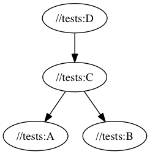

# buck-purescript
Set of macroses for [Buck](https://buckbuild.com) that brings support of [PureScript](http://www.purescript.org) to this build system

## API

``` python
ps_module(name,                      # Name of the module
          src = None,                # List of source file which belongs to the module
          modules = [],              # List of depended modules
          deps = [],                 # List of external dependencies e.g. bower links
          tests = [])                # Test files. One Test.Main which should import others

ps_test(name,                        # Name of the test module
        src = [],                    # Test files. One Test.Main which should import others
		modules=[],                  # List of depended modules
		deps = [],                   # List of external dependencies e.g. bower links
		test_deps = test_def_deps)   # By default purescript-test-unit 6.0.1 and purescript-strongcheck 0.14.7 would be added to deps list, unless you pass test_deps
```

Bower links uses format like `[name] [version]`. Here the example:

``` python
## cat Lib/BL/BUCK

# Assumes Customer.purs exists in the same folder
ps_module('Customer')

# Assumes Company.purs exists and has a dependency on Customer.purs
ps_module('Company',modules=':Customer')

# Multiple files in the module
ps_module('Product',src=['Product.purs','ProductHelpers.purs'])

# Order.purs and test file OrderTest.purs
ps_module('Order',test='OrderTest.purs')

# Test file OrderIntegration.purs which uses Order module
ps_test('OrderIntegration',modules=':Order')

# Receipt.purs which has a bower dependency on "purescript-string":"0.1.0"
ps_module('Receipt',modules=':Order',deps='purescript-string 0.1.0')

# Test module ReceiptTests.purs with additional bower dependency
ps_test('ReceiptTests',modules=':Receipt',deps='my-own-integration-test-helper 0.1.0')
```

Have a look on [tests](tests/BUCK) for more examples

## Status

Active development - basic tests passes, although requires polishing

## Why PureScript with Buck

- Buck could be used as a **final** build system which can handle all kinds of different languages in your project/company. It's such a joy being able to build any iOS/Android/PureScript/Clojure/Java/Rust/Haskell project by simply using `buck build [target]` or `buck test [target]` to run tests on any of those
- Another great idea that Buck allows/encourage you to split your project/library into many small modules, which then can be heavily reused later on: Rather than `one application - one project` you may end up with `one application - hundred modules(libraries)`, where each module is a complete library with it's own dependencies, sources and tests
- Side benefit (which I actually enjoy a lot) - you don't add dependency to your application, rather you add dependency to specific modules
- Buck builds and runs tests in parallel - with 32 cores you end up with 40 jobs that can handle **a lot**. Cool thing - Buck only runs build and tests when you actually need it: Changed one module - then only this and dependent(!) modules will be rebuild and tested
- Universal CI script: `buck build "//..." && buck test "//..."`. Buck is smart enough to rebuild and test only those which were affected by change
- Universal pre-commit hook: `git status -s | awk '{print $2'} | xargs -I {} buck query "owner('{}')" | xargs buck test` - Find all the files that got changed; find all modules which uses those files; run tests for those
- Want to know what depends on what in your repo? `buck query 'deps(//tests:D)' --dot | dot -T png > d.png && open d.png` 



## How does it work

Right way would be to extend Buck and support PureScript natively, unfortunately it takes a lot of time (actually it requires a lot of Java time - I cannot handle that much). Although we can do quiet a lot with macroses, here the workflow:
- `ps_define_module` is a main function. It generates two `genrule` and one `sh_test`
- First `genrule` (name equal to module name) takes `purs` sources and simply generates usual PureScript folder structure. Two issues:
  - We have to put `purs` file into the right sub-folder in `src`. How? We parse module definition using regex (yep)
  - We have to track dependencies - we simply merge all the module and submodules dependencies together and put it into `bower.json`
- Second `genrule` (name equal to module name + `_build`) simply runs `npm-cache install && $(npm bin)/pulp build` inside the generated folder
- `sh_test` is rather simple `$(npm bin)/pulp test`

It may look really hacky, but it turns out it works rather well. The only issue is a bit of slowness: As we have to regenerate folder it requires some time (even with `npm-cache`): normal 5s vs 15s with buck. **But!**: Buck is very smart to not rebuild things that wasn't changed - with big projects Buck approach would win without any doubt.

## Requirements

We are heavily using `Bash` scripting, so it has to be there. Following commands are expected to be in PATH:
- `mkdir,touch,echo,cp,cat` - usual stuff
- `rsync,sed` - kinda usual as well
- `npm-cache` - Buck main philosophy is that building is `f(files) -> files` which means that `npm` and `bower` dependencies has to be fetched and installed every time. [npm-cache](https://www.npmjs.com/package/npm-cache) dramatically improves build speed, so it has to be installed and available in `PATH`
- `buck version v2016.03.28.01` or newer. It should work on older versions as well, but this it what I'm using and confident that it supported

## Installation

Copy `RULES` folder to the root of your Buck repo. Then in your BUCK files reference it as include_defs('//RULES/buck-purescript/lib). Alternatively use [.buckconfig includes](https://buckbuild.com/concept/buckconfig.html#buildfile.includes)

If you want to put it in a different place - make sure that you've changed `target` function definition in `lib` file.

## References

I'm using the same idea which I've used in [clojure-clojurescript-buck](https://github.com/artemyarulin/clojure-clojurescript-buck). Actually this pattern could be used for bringing **any** languages to Buck, which is awesome
